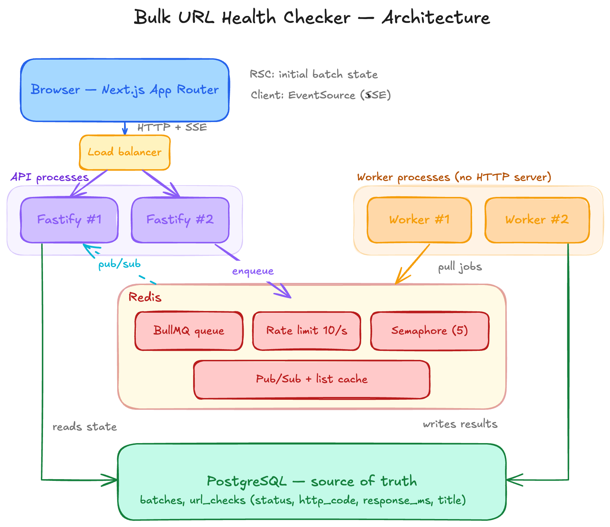

# Bulk URL Health Checker

Submit a list of URLs, check them in the background, watch results arrive live.

## Status

Built so far:

- [x] Monorepo scaffold (API, worker, web, contracts)
- [x] PostgreSQL schema + migrations
- [x] Batch submission (paste or CSV) with validation and persistence
- [x] Job enqueueing to BullMQ
- [x] Worker processing (rate limit, concurrency, retries)
- [x] Live updates (SSE)
- [ ] UI (batch list + batch detail)
- [ ] Cancel / retry-failed controls
- [ ] Batch list caching

## Running the system

> A single-command setup is not yet in place — the API, worker, and web app
> currently run on the host while Postgres and Redis run in containers. This
> will be consolidated before delivery.

```bash
pnpm install
cp .env.example .env
cp apps/api/.env.example apps/api/.env
cp apps/worker/.env.example apps/worker/.env
cp apps/web/.env.example apps/web/.env.local

pnpm run docker:up                        # Postgres + Redis
pnpm --filter @url-checker/api migrate:up # apply schema
pnpm --filter @url-checker/contracts build
pnpm run dev                              # api + worker + web
```

- API: `http://localhost:4000`
- Web: `http://localhost:3000`

## Architecture



Four process types, deliberately separated:

| Process              | Responsibility                                                                           |
| -------------------- | ---------------------------------------------------------------------------------------- |
| **Next.js web**      | UI. Server components fetch initial state; client components hold the live connection.   |
| **Fastify API**      | HTTP surface. Reads state from Postgres, enqueues jobs to Redis. Horizontally scalable.  |
| **Worker**           | Pulls jobs, performs HTTP checks, writes results. No HTTP server. Horizontally scalable. |
| **Postgres / Redis** | Source of truth / scheduling and coordination.                                           |

### Where state lives

**PostgreSQL is the single source of truth.** Every piece of batch and job state the user can observe lives there. The API reads state exclusively from Postgres; workers write results exclusively to Postgres.

**Redis holds nothing that cannot be rebuilt.** It is scheduling and coordination infrastructure: the BullMQ queue, the global rate limiter, the concurrency semaphore, pub/sub fanout for live updates, and the batch-list cache. If Redis were flushed, no user-visible truth would be lost — only in-flight scheduling.

This split is what makes cancel, retry-failed-only, and idempotency tractable.

## Design decisions

### Batch status is stored; progress counts are derived

`batches.status` holds a lifecycle state (`pending` / `running` / `completed` / `cancelled`). Per-status counts are computed from `url_checks` on read.

Cancellation is an instruction, not a summary — a cancelled batch and a finished batch can have identical child rows, so the batch-level fact needs its own home. Everything that _can_ be derived is derived, so it cannot drift.

### `succeeded` means "we got an answer", not "the site was healthy"

A 404 is a **successful check** that recorded status 404. Only genuine transport failures (timeout, DNS failure, connection reset) mark a check `failed`.

If `succeeded` meant 2xx, "retry failed only" would re-check every 404 forever — they could never leave the failed state. This is also why `http_status` and `error` are separate columns: a failed row has no HTTP status at all, because no response ever arrived.

### Persist first, enqueue second

Batch and URL rows are committed to Postgres **before** any job is enqueued.

Enqueueing inside the transaction would be a correctness bug: Redis has no knowledge of Postgres transaction boundaries, so a worker could pick up a job and query for a row that is not yet visible — or that a rollback means will never exist.

**Known gap:** if the API crashes between `COMMIT` and `addBulk`, rows sit in `queued` with no jobs behind them. Mitigated by deterministic job IDs, which make re-enqueueing safe. See Trade-offs.

### Two independent retry counters

| Column          | Meaning                                                               |
| --------------- | --------------------------------------------------------------------- |
| `attempt_count` | Automatic retries within one run (BullMQ, exponential backoff, max 3) |
| `run_number`    | User-initiated re-runs via "retry failed only"                        |

A URL can be on run 2, attempt 1. Conflating them would lose the ability to answer "did this URL need retries?" after a manual retry.

### `run_number` is the idempotency guard

Every worker write is conditional on the run it belongs to:

```sql
UPDATE url_checks
SET status = 'succeeded', http_status = $1, ...
WHERE id = $2 AND run_number = $3;
```

Scenario: a check fails, the user clicks retry, the row moves to run 2. The _original_ worker is still in flight and about to write a stale result. Its write matches zero rows and is silently discarded.

The same column produces deterministic BullMQ job IDs — `${checkId}#${runNumber}` — so enqueueing the same run twice yields one job, not two.

### BullMQ's rate limiter is global; its concurrency is not

| Option                       | State location | Global across processes?       |
| ---------------------------- | -------------- | ------------------------------ |
| `limiter: { max, duration }` | Redis          | Yes — free                     |
| `concurrency: n`             | Process memory | **No** — multiplies per worker |

Two workers at `concurrency: 5` yields 10 in flight, violating the requirement. Global concurrency is therefore enforced by a Redis ZSET semaphore acquired before each HTTP request.

The acquire is a Lua script so that evict-expired → count → add is atomic; as three separate commands there would be a race between counting and adding. Slots carry a TTL longerthan the request timeout, so a SIGKILLed worker's slot self-evicts instead of permanently reducing capacity.

Local `concurrency` is set _above_ the global limit so workers keep pulling and queue on the semaphore rather than idling while another process holds slots.

### Retries distinguish transport failure from HTTP response

Retried: DNS failure, connection refused, timeout, reset. Not retried: any HTTP response (including 4xx/5xx), which is a _successful check_. Not retried: superseded or cancelled jobs — signalled with `UnrecoverableError`.

Failure is persisted inside the processor on the final attempt rather than in a `failed` event handler, so Postgres remains authoritative even if the worker dies between exhaustion and the event firing.

### Response bodies are read only until `</head>`

Streaming with a 512KB ceiling, aborting once the head closes. Otherwise a URL pointing at a large file would be fully buffered into worker memory. Non-HTML responses have their body cancelled without reading.

### SSE, with the live channel treated as an optimization

Chosen over WebSockets (data flow is strictly one-way; no upgrade handshake or separate infrastructure) and over polling (constant request overhead). `EventSource` reconnects automatically with no client-side retry logic.

**The live channel is not a correctness mechanism.** Cold load, refresh, and reconnect all resolve by fetching full state from `GET /api/batches/:id`. SSE only spares the client from polling — remove it entirely and the app is still correct.

### Snapshot-on-connect rather than `Last-Event-ID` replay

SSE supports replaying missed events via `Last-Event-ID`, which would require a durable ordered event log per batch with retention.

Instead, every connect and reconnect re-fetches full state, making missed events structurally irrelevant. Identical correctness, no event store.

_Trade-off:_ a snapshot is heavier than a delta — a few hundred KB at 500 URLs.

### Pub/sub messages carry IDs, not data

The worker publishes `{ type, checkId }`. The receiving API instance reads current state from Postgres and constructs the event.

A published payload could otherwise carry a snapshot that is already stale by delivery. Passing an ID keeps Postgres the only source of data.

### Multi-instance fanout

A worker finishing a job has no knowledge of which API instance holds a given client's connection. It publishes to `batch:{id}`; every API instance subscribes, and whichever holds the socket forwards it.

One Redis subscriber per API _process_, fanned out in memory to that process's clients — not one Redis connection per browser tab.

## Next.js: server/client boundary

| Concern                     | Component type | Reason                                                                                         |
| --------------------------- | -------------- | ---------------------------------------------------------------------------------------------- |
| Initial batch list / detail | Server         | Cold open must ship correct state in the HTML — no loading flash, no post-hydration round trip |
| `EventSource` subscription  | Client         | Requires a persistent browser connection                                                       |
| CSV parsing, form state     | Client         | `FileReader` and interactivity are browser-only                                                |

Server components fetch the initial snapshot and pass it to a client component as a prop. The client component seeds its state from that prop and takes over live updates. A client-side `useEffect` fetch would work but would show an empty shell on cold open — the opposite of what the brief requires.

`export const dynamic = "force-dynamic"` on both pages: batch state is live and must never be statically rendered at build time. `cache: "no-store"` is set explicitly on every fetch rather than relying on the framework default.

### The list page has no live connection — deliberately

The batch list is served from a 30-second cache; pushing live updates into it would contradict its own caching strategy. The list is a directory, the detail page is the live view. `router.refresh()` after submission revalidates it.

### No server actions

The POST goes to Fastify, not Next. A server action would mean Next proxying to our own API for no benefit, and would blur the API/UI process separation.

## Assumptions

Recorded rather than asked, per the brief:

1. **Duplicate URLs within a batch are permitted.** Pasting the same URL twice is plausible user input, not an error. Deduplicating would silently change `total_urls` from what th user submitted. No unique constraint on `(batch_id, url)`.

2. **Partial acceptance on validation.** If 100 URLs are submitted and 3 are malformed, the 97 valid ones proceed and the rejected ones are returned in the response with reasons. Rejecting the whole batch was judged hostile.

3. **CSV parsing is client-side.** A CSV of URLs is a presentation concern — the browser reads the file and posts the same `{ urls: string[] }` payload as the paste box. This avoids a second server-side parser and failure path. For large or structurally complex files, server-side parsing would win.

4. **Only `http` and `https` are accepted.** Also a security boundary: without it, `file:///etc/passwd` would be fetched by the worker. See Known limitations.

5. **500 URLs per batch maximum.** Arbitrary but finite; enforced on both sides from a single shared constant.

## Known limitations

- **SSRF is only partially mitigated.** Protocol is restricted to http/https, but private IP ranges (`10.0.0.0/8`, `127.0.0.0/8`, `169.254.169.254`) are not blocked. A production system must reject these after DNS resolution.
- **No authentication.** Explicitly out of scope.
- **The commit/enqueue gap** described above is documented, not closed.
- **Rate limiting is global, not per-host.** 10 req/s spread across many hosts is polite; 10 req/s at a single host is not. Per-host bucketing would be the production answer.
- **The semaphore polls at 100ms** rather than using pub/sub notification. Simpler, and with a 5-slot ceiling the contention does not justify the complexity.
- **No SSE connection limit per client.** A tab opening many batch streams would hold many connections. Production would cap this or multiplex batches over one stream.
- **Heartbeat is 25s**, chosen to sit under common 30s proxy idle timeouts. Tuning depends on the actual deployment.
- **No pagination on the batch list** — capped at 100 most recent.
- **No virtualization on the batch detail table** — 500 rows render fine; a much larger batch would need windowing.

## Trade-offs

**Commit-then-enqueue instead of a transactional outbox.**
An outbox table plus a relay process would close the crash window entirely. Given the time budget, deterministic job IDs plus Postgres-as-truth make the gap recoverable rather than fatal. _With more time:_ outbox pattern.

**Raw SQL over an ORM.**
The idempotency story here _is_ the conditional `UPDATE ... WHERE run_number = $n`. An ORM would abstract away exactly the mechanism worth showing. `node-pg-migrate` keeps DDL as the source of truth with no schema-drift ambiguity.

**pnpm workspaces over Turborepo.**
Build caching is irrelevant at this size. One less tool to justify.

## Type safety

`packages/contracts` is imported by both the API and the web app, so status enums, entity shapes, and request/response contracts have exactly one definition.

Types alone vanish at runtime, so request bodies are validated with Zod at the API edge — the boundary is enforced, not merely declared.

## Database schema

| Table        | Purpose                                                    |
| ------------ | ---------------------------------------------------------- |
| `batches`    | Lifecycle state, `total_urls`, timestamps                  |
| `url_checks` | One row per URL: status, result columns, retry bookkeeping |

Indexes support the three real access patterns: batch detail (`batch_id, created_at`), progress counts and retry-failed lookup (`batch_id, status`), and the batch list (`created_at DESC`).
